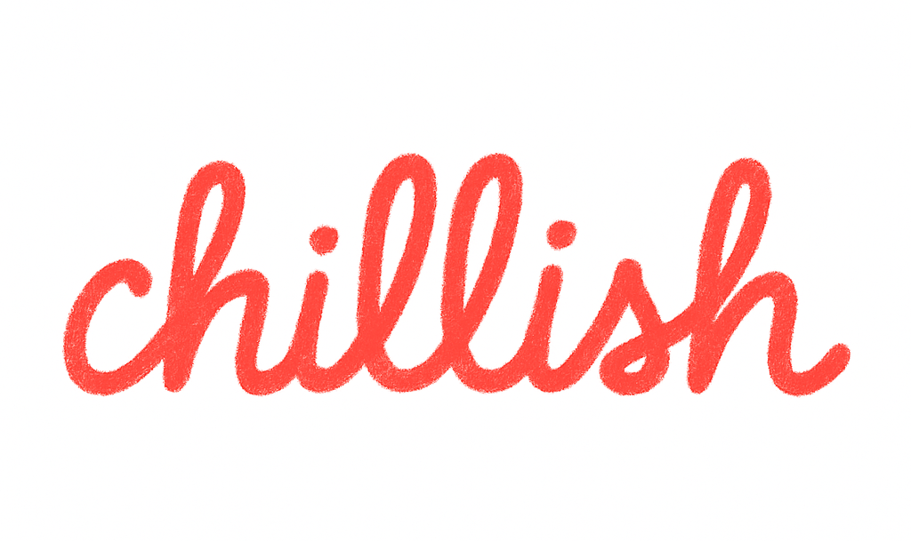

# chilllish 📕
Reinvent the dictionary. Learn English the way real people speak, powered by LLMs

## 🥱 TL;DR — Too long; didn't read
- 🤔 Another boring language app? **🙅‍♂️ Hard nope.**
- **📕 Chilllish Dictionary** is your new chill BFF powered by _🤖 big-brain LLMs (Large Language Models)_ — here to help you speak English like _real people_ do.
- Wanna sound like a city slicker 🏙️, a top scholar 🎓, or just less like Google Translate? This app vibes with **YOUR** style.

## ✨ Features
0. **⚙️ Setup** - Pick your vibe (Professional 💼, Street 🧢, Academic 📖). All features will match your tone.
1. **📚  Dictionary** – Drop any word/phrase to get meaning, pronunciation, origin, and more—in your tone.
2. **✍️ Rewrite** – Fix your text to sound more natural, show the mistake, and explain what and why’s off.
3. **🌍 Translation** – Send any non-English line, get it back in chill, real-life English that fits your vibe.
4.  **🧠 Flashcard** – Quiz-style flashcards w/ spaced repetition to help you actually remember new words.
5. **🔥 Word of the Day** –  Discover new words daily, with themes like _Slang Sat_ or _Formal Fri_

## ⭐ Road Maps
- **Listen Mode** user an hear native pronunciation in different accents (US, UK, AU).
- **Practice Mode** user say certain words / phrases and application will tell u how could it be improved.
- **Conversation Mode** practice talking with AI chosen style
- **👯‍♀️ Compare Style Mode** Show same sentence in multiple styles side-by-side:
  - Teen: “That’s fire!”
  - Academic: “This is impressive.”
  - Professional: “Very well done.”
  - Let them see how tone shifts.
- **✍️ Smart Notes**: Let users save words into themed notebooks (e.g., “Work English,” “Travel,” “Flirting” 😏). Bonus if you auto-suggest tagging words.
- Integrate with 3rd party flash cards e.g. [[Anki]]

## 📈 Bonus Growth Triggers
- **Share card** as image/story 📸
- **Leaderboard** for most learned this week
- **Referral** = unlock premium features
